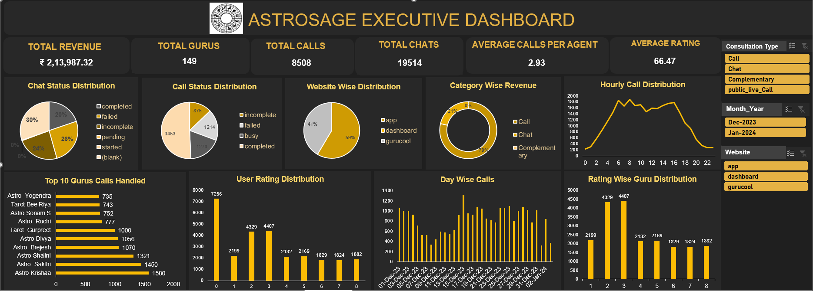

# 📊 AstroSage Call Center Performance Analysis

<p align="center">


</p>

---

# 📌 Project Overview

This project presents an end-to-end Data Analytics solution for AstroSage's call center operations.

The objective is to analyze historical consultation data, identify operational bottlenecks, and recommend the best allocation strategy for a ₹1 Crore investment to improve operational efficiency, customer satisfaction, and profitability.

The analysis was completed entirely using Microsoft Excel, including data cleaning, feature engineering, Pivot Tables, Pivot Charts, KPI Dashboard creation, and business recommendations.

---

# 🎯 Business Problem

AstroSage received a ₹1 Crore investment to improve its customer support operations.

The challenge was to determine how the investment should be allocated among:

- Hiring more agents
- Improving training programs
- Upgrading call center technology

A detailed analysis was performed to support data-driven business decisions.

---

# 🛠 Tools & Skills Used

- Microsoft Excel
- Pivot Tables
- Pivot Charts
- Dashboard Design
- Data Cleaning
- Data Validation
- Conditional Formatting
- Lookup Functions
- COUNTIF
- SUMIF
- AVERAGE
- GETPIVOTDATA
- CORREL
- Business Analysis
- Data Visualization

---

# 📊 Dashboard Preview

> Add your dashboard screenshot below.



---

# 📂 Repository Structure

```text
AstroSage-Call-Center-Analysis
│
├── Dashboard
├── Documentation
├── Excel
├── Presentation
├── Images
├── README.md
├── LICENSE
└── .gitignore
```

---

# 📈 Key Performance Indicators (KPIs)

- Total Consultation Records Analyzed
- Daily Call Volume
- Monthly Call Volume
- Call Completion Rate
- Customer Satisfaction Score
- Revenue Analysis
- Guru Performance
- Repeat Customer Analysis
- Peak Hour Analysis
- Operational Cost Analysis

---

# 📌 Key Insights

✅ Voice calls generated the highest revenue.

✅ Customer satisfaction averaged around 2.93.

✅ Significant workload imbalance exists among gurus.

✅ Peak call traffic occurs during daytime hours.

✅ Only around 41% of calls were completed successfully.

✅ Intelligent call routing and infrastructure upgrades offer the highest ROI.

---

# 💼 Business Recommendations

- Upgrade call routing technology
- Improve agent training programs
- Optimize workforce allocation
- Reduce failed and unanswered calls
- Introduce predictive staffing
- Improve customer experience
- Monitor KPIs using dashboards

---

# 📁 Project Deliverables

| File           | Description                                |
| -------------- | ------------------------------------------ |
| Excel Workbook | Complete analysis and dashboard            |
| Documentation  | Business questions with detailed solutions |
| Presentation   | Executive summary and insights             |
| Dashboard      | Interactive KPI dashboard                  |

---

# 📚 What I Learned

- Cleaning real-world datasets
- Building interactive Excel dashboards
- Business storytelling using data
- Data visualization best practices
- KPI reporting
- Pivot Table analysis
- Decision-making using analytics

---

# 🚀 Future Improvements

- Power BI Dashboard
- SQL Integration
- Python Data Analysis
- Automated Reporting
- Machine Learning Forecasting

---

# 👨‍💻 Author

**Koushik Yarram**

Data Science Learning Journey (Phase 1 – Data Analytics)


---

⭐ If you found this project useful, consider giving it a star.
